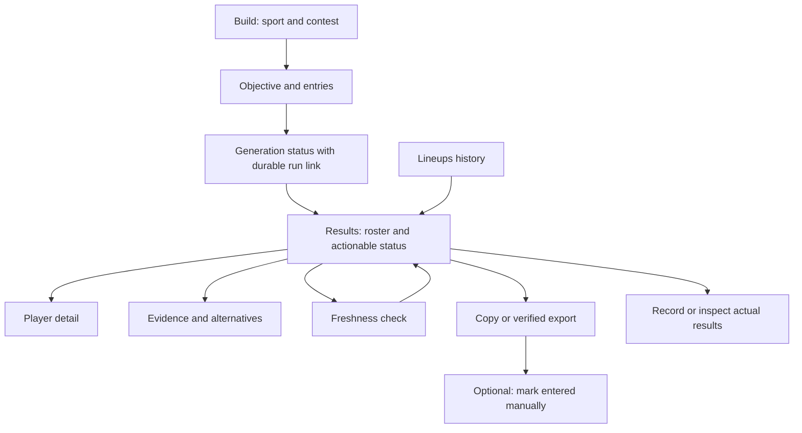

# Mobile-first UI/UX audit and app polish implementation plan

**Project:** FLOYD DFS / fantasy-ai  
**Date:** September 30, 2026  
**Status:** Design and engineering handoff; proposed work is not implemented.  
**Scope:** Builder, generation, live and saved lineup results, player/evidence details, research, history, result recording, learning, shared navigation, system states and design-system implementation. MLB, NFL, WNBA, college football and golf must all work. Existing NBA surfaces must not regress.  
**Companion:** [Lineup quality root cause and engineering plan](lineup-quality-root-cause-and-engineering-plan.md).

## 1. Design assessment

The app has a recognizable sports-tool foundation: navy navigation, restrained cyan accents, slate selection, player portraits, roster slots, salary totals and expandable analysis. Preserve that familiarity. The main opportunity is to make the lineup the visual center of the experience and make deeper research easy to inspect when needed.

Currently, almost every layer competes for attention. Setup controls stay above completed results on mobile. The same projection appears in the result summary, lineup header, metric strip and reasoning panel. Individual player cards repeat their projection and devote substantial vertical space to labels, badges and metadata. Long reasoning and warnings precede the roster. Heavy uppercase labels and many borders make secondary content feel as important as the decision.

The polish should deliver a **compact sports roster with an accessible research layer**:

1. Choose sport, slate and contest with clear lock information.
2. Set a plainly named objective and generate.
3. Immediately see the lineup, salary, forecast type and actionable readiness state.
4. Inspect a player, source or alternative with a deliberate tap.
5. Recheck and export/copy using accurately labeled actions.
6. Return later to the same lineup presentation and inspect actual results.

Visual confidence must not outrun model confidence. A more attractive card cannot turn an unvalidated forecast into a trustworthy prediction. The quality plan owns backend truth; this plan owns faithful, legible presentation and interaction.

### 1.1 Evidence and limits

This review combines source inspection with local Chromium rendering of the actual app using intercepted, synthetic API responses. No real contests were entered, no live generation was invoked, and no paid-provider calls were made. Fake player names, teams and scores are layout fixtures, not recommendations or forecasts. External images were deliberately blocked to inspect fallback behavior.

Reviewed source includes `App.tsx`, `Navigation.tsx`, `MIOS_FantasyScanner.tsx`, `ScanPage.tsx`, `LineupDisplay.tsx`, `RunPage.tsx`, `ReasoningPresentation.tsx`, `ResearchPage.tsx`, `HistoryPage.tsx`, `LearningPage.tsx`, shared primitives, ticker, toasts, skeletons, error boundary, theme/tokens and client view-model mapping. The admin design-system example was inspected in source; it was not visually certified through the admin guard.

| Evidence | Interpretation |
| --- | --- |
| [Mobile builder](ui-ux-audit-evidence/01-mobile-builder.png) | Actual layout with a synthetic available slate. Advanced controls precede sport and contest choice. |
| [Mobile generated results](ui-ux-audit-evidence/02-mobile-results.png) | Single six-player fixture; setup remains above results and summaries precede the roster. |
| [Narrow mobile results](ui-ux-audit-evidence/03-small-mobile-results.png) | Stress case at 320 CSS pixels; inspect header collisions and sticky summary behavior. |
| [Desktop generated results](ui-ux-audit-evidence/04-desktop-results.png) | Existing three-region layout; the central roster remains narrow when both side regions appear. |
| [Mobile saved run](ui-ux-audit-evidence/05-mobile-saved-run.png) | Different, much smaller roster treatment; run metadata and diagnostics dominate surrounding content. |
| [Mobile learning](ui-ux-audit-evidence/06-mobile-learning.png) | Technical run-ID workflow and long explanatory copy in a primary navigation destination. |
| [Measurements](ui-ux-audit-evidence/measurements.json) | Viewport/document dimensions and a failed-save interaction probe. Counts of small-text DOM elements include nested elements; they are not a count of unique labels or a WCAG score. |

The 390-pixel fixture rendered a 1,175-pixel builder page and a 3,313-pixel generated-results page; the saved run was 1,965 pixels tall. The first roster name began approximately 2,140 pixels down the generated-results document at 390px width. These are illustrative baseline observations, not universal page-size requirements. The measured document width equaled viewport width at 320, 390 and 1,440 pixels. **No document-level horizontal overflow was observed in these fixtures.** That does not rule out internal clipping, cramped columns or obscured content.

The interaction probe returned HTTP 500 for “mark entered”; the app showed the error and still disabled the button with success styling. That is a reproduced behavior defect, not a subjective design preference.

Physical iOS/Android testing, screen-reader testing, full contrast measurements, production screenshots, real contest data and participant usability sessions remain execution tasks. Do not describe this review as complete WCAG certification or measured user research. DraftKings/FanDuel are structural references requested by the user; this is not a current competitive-product audit.

## 2. Audit findings and priorities

**P0:** Incorrect or misleading action/state; fix before new visual assurance. **P1:** Core task completion, mobile hierarchy or accessibility. **P2:** Consistency and polish. “Source” indicates code-confirmed behavior; “rendered” indicates observed in fixture screenshots; “hypothesis” requires user/device testing.

| ID | Priority / evidence | Finding, effect and source | Required response |
| --- | --- | --- | --- |
| UX01 | P1 / source + rendered | Builder shows entries, field size, payout shape, objective and overlap before sport/slate. `MIOS_FantasyScanner.tsx`. Users must interpret advanced concepts before choosing the event. | Reorder around sport → format → slate/contest → objective/entries; move advanced constraints into disclosure. |
| UX02 | P1 / source + rendered | Completed results are below the full builder on narrow screens. `ScanPage.tsx` retains the sidebar in document flow. | Dedicated result route/view; replace setup with a compact editable context summary. |
| UX03 | P1 / source + rendered | Sticky result summary has five pills in a two-column mobile grid; multiple tall summaries compete with roster space. | A small context bar; forecast/salary once in the lineup overview; avoid persistent multi-row summary blocks. |
| UX04 | P1 / source + rendered | Lineup header places large unshrinking points beside badges and a truncated title. At narrow widths the left content becomes squeezed/collides. `LineupDisplay.tsx`. | Stack header regions on small containers; use container-aware composition and separate projection value from label. |
| UX05 | P1 / source + rendered | Narrative, evidence and strategy text precede player rows; median repeats across several components. Collapsed cards still include significant prose. | Roster first, concise decision summary, then progressive disclosure. Collapsed variants show only essential comparison data. |
| UX06 | P1 / source + rendered | Many useful labels are 9–11px uppercase; player projections repeat as “Projection” and “Floyd median.” All-bold treatment weakens hierarchy. | Readable type scale, fewer labels, sentence case and tabular numeric alignment. |
| UX07 | P1 / source + rendered | Player rows become tall bordered cards, with a separate salary/projection row on mobile. News snippets truncate without a full detail affordance. | Compact roster rows with player detail sheets; keep actionable alerts visible. |
| UX08 | P0 / reproduced | `LineupDisplay.markEntered` sets local success after `onSaveLineup`; `ScanPage.onSave` catches failure without rethrowing. Rank-based local state can also leak between result sets. | Server-confirmed mutation state keyed by run/lineup ID, explicit failure, pending lock and state reconciliation. |
| UX09 | P0 / source | “Lineup Entered” is presented as the action before entry is recorded. No visible distinction between copying/exporting, manually marking entered, and submitting to DK. | Separate actions and labels; never imply the app submitted a contest entry. |
| UX10 | P0 / source + rendered | Result summary may say “Data ok” while the manifest shows partial/unvalidated warnings. `generateFloydLineups` returns an empty `data_warnings` array; caution information lives elsewhere. | One normalized readiness contract across pages; show model/data/freshness states faithfully. |
| UX11 | P1 / source | `ExportLineup.tsx` exists but is not mounted in current routed result components. Its CSV is a review table, not a DK slot-ID upload, and “Projected” uses historical last-five average. | Design accurate copy/review-export actions; only offer DK upload when the quality-plan export contract is verified. |
| UX12 | P1 / source + rendered | Saved runs use a separate mini roster and diagnostic layout rather than the live result card. Player salary/projection details and primary actions differ. | One shared results model and component family for live, history and deep links. |
| UX13 | P1 / source | Research is a flat list with raw URLs and occasional reliability values; no meaningful impact/freshness grouping. Back-to-run appears only in the empty case. | Event/player/impact filters, source age, plain-language resolution states and persistent return navigation. |
| UX14 | P1 / source | Reasoning is centered on `lineups[0]`, not a selectable lineup. Finding/alert lists are sliced without a universal “view all” path. | Bind research to selected lineup/player and preserve access to every relevant warning/source. |
| UX15 | P1 / source + rendered | Navigation always visually emphasizes Scan; no `NavLink`/current-route state. News sits above navigation on every page. | Active navigation, mobile destination model and contextual alerts instead of constant motion. |
| UX16 | P1 / source | News continuously animates, pauses only on hover, and repeats linked content, including focusable links within an aria-hidden duplicate group. | Static mobile alerts, pause controls where motion remains, reduced-motion support and no duplicate tab stops. |
| UX17 | P1 / source | History starts with empty rows and no distinct pending state, potentially showing “no persisted lineups” while fetching. Run/research use generic empty cards as loaders. | Explicit pending, empty, filtered-empty, failed and stale states with contextual actions. |
| UX18 | P1 / source + rendered | Learning exposes optional raw run ID, manual KEEP baseline and raw JSON in the main user flow. | Move readiness checks into the active lineup; keep engineering diagnostics in an advanced area. |
| UX19 | P0 / source | “Max Shared Players” is collected by the scanner but not forwarded by `ScanPage` to `generateFloydLineups`; some apparent configuration does not reach the execution request. | Audit every control-to-request-to-result binding. Wire and validate it or remove/disable it with an honest explanation. |
| UX20 | P1 / source | Toasts auto-dismiss after three seconds, are click-dismiss divs, and lack mobile width/safe-area constraints. Important failures also rely on these notifications. | Persistent inline errors, bounded toasts, accessible dismiss buttons and coordinated overlays. |
| UX21 | P1 / source | Form group labels are not consistently semantic fieldsets/legends; some standalone labels lack `htmlFor`. Filter button selected state is visual only. | Native semantics, associated help/errors, keyboard focus and state announcement tests. |
| UX22 | P1 / source | Blank actual points becomes `Number('') === 0` in History result recording. “Update result” needs verification against an insert-based result endpoint. | Validate required input before coercion and define result revision/idempotency semantics. |
| UX23 | P2 / source | Tokens, `theme.ts`, global headings and inline hex colors duplicate styling decisions. The design-system sample is not a complete production component inventory. | Semantic token source and actual production component/state catalog. |
| UX24 | P2 / source + rendered | Remote player/team imagery has no robust failure handling in some components. Missing images show broken placeholders in blocked-image fixtures. | Deterministic initials/team/sport fallbacks, stable dimensions and graceful image errors. |
| UX25 | P1 / source + hypothesis | Generation feedback largely lives in the button and generic skeletons; no clear resume/navigation contract is presented for durable jobs. | Dedicated truthful progress state, preserved run link, reconnect/retry behavior and no invented percent completion. |
| UX26 | P2 / source + rendered | Technical terms and identifiers—“stage lineage,” “deterministic,” game IDs, internal tiers—appear in primary task surfaces. | Plain-language task copy; technical trace remains accessible under details. |

### 2.1 What to preserve

- Navy/cyan identity and a familiar contest → roster → salary/action structure.
- Visible slot labels and portrait/initial fallbacks as player anchors.
- Existing native radio inputs and some focus-visible/accordion semantics.
- Clear separation of simulated versus calibrated probability where already labeled.
- Accessible full evidence rather than removing useful information to create whitespace.
- The single desktop builder alongside results where adequate width exists; the new design should adapt rather than stretch phone layouts across a large display.

## 3. Product structure and visual direction

### 3.1 Primary navigation and information architecture

Use three persistent mobile destinations: **Build**, **Lineups**, **Insights**. Research belongs to a selected run/player, not a disconnected global destination. Existing `/history` and `/learning` URLs should remain supported or redirect predictably; do not break bookmarked `/runs/:runId` and `/research/:runId` links.

- **Build:** sport, format, slate/contest, objective, entries; advanced controls when relevant.
- **Lineups:** active/recent/past runs; generated, marked entered and resolved states; filters and resume.
- **Insights:** measured results and model limitations when supported. Until those data contracts exist, provide an honest empty/provisional state rather than invented charts.
- **Run detail:** lineup selector, roster, actionable status, explanation, research and export/recheck actions.
- **Advanced diagnostics:** run ID, source failures, stage trace, model versions and diagnostic copy; accessible but not the first thing most users see.

Proposed mobile task flow:



### 3.2 Visual language

**Direction:** A crisp sports dashboard with strong roster alignment, restrained color, readable numbers and compact evidence indicators. Use team/sport imagery to provide identity; the roster and projected points provide visual interest. Avoid large decorative hero sections, excessive gradients, animated confidence meters or badges on every line.

| Element | Initial design specification | Purpose / constraints |
| --- | --- | --- |
| Canvas | Cool off-white, initially existing `#f4f7fb`; white content surfaces | Preserve current identity and separate interactive surfaces without boxing every datum. |
| Primary ink / header | Existing deep navy `#0b1f3a`; reserve darkest panels for shell and primary summary | One dominant dark region per view is generally enough. |
| Accent | Cyan for active selection/focus accents; dark cyan/navy text on light surfaces | Do not use bright cyan as small text on white without contrast verification. |
| Semantic color | Green = successfully completed/confirmed action; amber = attention; red = blocked/error | Green must not mean a guaranteed winner. Pair color with icon and text. |
| Typography | System sans initially; mobile page title 24–28px, section 18–20px, body/input 16px, dense row 14px, metadata 12–13px | No essential label below 12px. Use normal/medium body and semibold headings; reserve heavy weight for key numbers. |
| Numeric styles | Tabular numerals, right-aligned salary/points, one decimal for projections | Keep currency, projected points and probability units distinct. |
| Spacing | 4px base; 8/12/16/24/32 steps; phone gutters 16px, 12px at narrowest layouts | Reduce redundant wrappers rather than shrinking type. |
| Radius / borders | 12px cards, 8px controls, pills only for short statuses | Use dividers for roster rows; avoid nested card-on-card borders. |
| Elevation | Flat content, subtle primary surface; stronger shadow only for overlays/sticky controls | Establish layers without decorating every element. |
| Controls | 44px minimum product target; primary actions 48px high; 8px separation for nearby icon actions | This is a product usability target, not a claim that WCAG AA universally requires 44px. |
| Icons | Existing Lucide family, consistent stroke/size; 18–20px inline, 20–24px controls | Labels accompany primary actions. Decorative icons hidden from assistive technology. |
| Images | 32–40px player portrait, compact team/sport mark where useful | Stable aspect ratio, lazy loading, on-error fallback; do not fabricate real player headshots. |
| Motion | 120–180ms state transitions; 180–240ms sheet opening; reduced-motion alternative | No perpetual news motion or celebratory effects implying outcomes. |

These are initial product specifications. Contrast, readability and target geometry must be measured on final tokens and components.

### 3.3 Icon and language mapping

| Meaning | Suggested Lucide icon | Visible label / behavior |
| --- | --- | --- |
| Build | SlidersHorizontal | Build; avoid a wand suggesting unexplained magic. |
| Saved lineups | ListChecks | Lineups; route selected state exposed semantically. |
| Results/analysis | ChartNoAxesCombined | Insights; only show supported data. |
| Freshness | Clock3 | Checked 2m ago; exact timestamp on detail. |
| Update/recheck | RefreshCw | Check updates; spinner only while pending. |
| Confirmed successful operation | CheckCircle2 | Saved / Marked entered; never “winning.” |
| Watch item | TriangleAlert | Needs review; count and affected players. |
| Blocked | CircleX | Cannot export; reason and repair path. |
| Evidence | Newspaper / ExternalLink | Sources / Read report; distinguish internal details from external link. |
| Copy / export | Copy / Download | Copy lineup / Download DK CSV, only when correctly supported. |
| Details | ChevronDown / ChevronRight | Expand section / open player; do not use the same affordance for unrelated actions. |

Replace “Run Scan” with **Generate lineup** or **Generate 3 lineups**. Replace “Lineup Entered” as an action with **Mark as entered**. Replace “Stage lineage” with **How this was built** in user-facing copy; keep the technical label in diagnostics. Replace “Data ok” with a concrete supported state such as **Checked 2m ago · 1 item to review**. Never relabel a median as expected points during a visual-only release.

## 4. Screen and interaction specifications

### 4.1 Build / contest selection

**Phone order:** compact app header → sport selector → format → slate/date → contest → objective/entries → advanced options → primary action. The main decision is which event/contest to build for; field size and payout data should normally come from verified contest metadata.

- Sport selector: labeled tabs/chips with text plus optional small sport mark. Wrap or use an explicit “More sports” control at narrow widths; if horizontal scrolling is used, show that more choices exist and preserve keyboard access.
- Slate/contest cards: matchup or tournament, date/time/lock, format, game count, verified contest name and meaningful availability. Hide raw game IDs from normal cards. Distinguish the game/slate from the specific contest and economics.
- Changing sport/format clears incompatible selections and visibly updates dependent choices. Preserve valid user preferences per sport/format, not stale contest IDs.
- Basic mode: objective + number of lineups. Advanced disclosure: overlap/exposure/locks and supported constraints. Show a compact summary when changed; do not imply unsupported inputs are enforced.
- Format-specific copy: Golf tournament/round rather than “Game”; MLB doubleheader game identity; WNBA/NFL/CFB matchup and time. Only show actually supported variants.
- Validation: inline field errors and a short summary above the action; focus first invalid field. Keep selections after recoverable failures.
- After generating, transition to a durable run/result URL; browser Back returns to preserved setup. “Edit build” is visible from results.

### 4.2 Generation

Use a dedicated progress panel reflecting backend stages in user language: **Checking contest → Researching updates → Projecting players → Building lineups → Finalizing**. Stage grouping must map to real backend events.

Show contest, elapsed time, current activity and a durable run link. Avoid a percentage unless actual progress is measurable. On slow response, say the run is still processing and offer to view it later. On disconnect, reconnect to the same run; do not duplicate generation. A cancel action is offered only if backend cancellation exists; otherwise use “Leave this screen; run continues.”

Announce stage changes politely, not every elapsed second. Completion navigates/focuses the result heading without unexpectedly moving focus while the user is editing another control. Preserve previous successful results until the replacement is clearly identified as new.

### 4.3 Results — the primary redesign

Default view is the roster. Results must answer “What was selected?”, “What does it cost?”, “What is projected?”, “What needs attention?” and “What can I do next?” without opening diagnostics.

Illustrative phone structure; values below are placeholders, not data:

```text
┌─────────────────────────────────────┐
│ ‹ Lineups           WNBA · Showdown│
│ Away @ Home             Edit build │
│ Locks 7:30 PM ET · checked 2m ago   │
├─────────────────────────────────────┤
│ Lineup 1 of 3       Compare / More │
│ Projected mean  —     Salary $—/—  │
│ △ 1 player needs review     Review │
├─────────────────────────────────────┤
│ SLOT   PLAYER              $  PTS │
│ CPT    Portrait · Name      —   — │
│        Team · opponent · status  › │
│ UTIL   Portrait · Name      —   — │
│        Team · opponent           › │
│ …remaining legal roster slots…    │
├─────────────────────────────────────┤
│ Why this lineup               ˅   │
│ Sources & updates             ˅   │
│ Alternatives / comparison     ›   │
│ Advanced details              ˅   │
├─────────────────────────────────────┤
│ Check updates     Copy / Export    │
│ Build          Lineups     Insights│
└─────────────────────────────────────┘
```

**Hierarchy contract:**

1. Contest/lock identity, selected lineup and supported forecast label.
2. One compact status summary with any blocking reason visible.
3. Roster in official slot order, including Captain emphasis where applicable.
4. One short “why” sentence or up to three concise reasons, expandable for full trace.
5. Secondary analysis, evidence and diagnostics.

**Roster rows:** slot badge; portrait or initials; name with up to two lines; team/opponent or sport-specific subtitle; aligned salary and slot-adjusted projected points. Put one actionable status marker adjacent to the player. Do not show several percentile, role, form and ownership figures by default. “Unknown” never appears as a fabricated zero.

**Projection integrity:** Default mean is available only after the quality plan supplies it. Until then show **Projected median**, not a cosmetic “mean” replacement. Explain multiplier treatment; player contributions must reconcile with the displayed lineup mean when that metric is additive. A lineup median is not generally the sum of player medians—label this clearly rather than forcing arithmetic. Use exact cap and salaries from the rules contract, not a hardcoded `$50k` string.

**Density target:** At 390×844, in a standard nonblocked single-lineup fixture, show result identity, status, forecast/salary and at least three roster rows in the initial viewport. Aim for 64–80px basic rows at default text size, with automatic growth for names and accessibility scaling. Targets never justify hiding critical warnings or clipping enlarged text.

**Multiple lineups:** visible index/selector with labels, previous/next buttons and a list view. Swipe can supplement buttons, never replace them. Keep selected lineup in the URL; evidence and actions follow that selection. In comparison mode, emphasize changed athletes/Captain, objective delta, salary and shared-player count; do not repeat two full dossiers side by side on a phone.

### 4.4 Player detail and research

Tapping a roster row opens a labeled detail sheet on phone and drawer/panel on wider screens. Header contains full player name, team/event, role and close action. Show projection/uncertainty, playing opportunity, relevant availability, top model-changing facts and sources. Use sport-appropriate context; no generic “role 97%” without a defined calibrated metric.

“Why selected” should include the actual numerical/constraint tradeoff and a meaningful alternative when the backend provides it. “News” alone is not proof of model impact. Show **Fact**, **Model estimate**, **Unknown** and **Last checked** distinctly. All clipped snippets must open complete content.

Research route: summary by affected players, availability/role, matchup/environment and unresolved items. Filter to selected lineup, all slate or a player; show source name/domain, published/checked time and resolution. Group duplicated reports; retain conflicts. Replace raw URL strings with descriptive source links. Back returns to the same lineup and scroll position.

### 4.5 Readiness and action bar

The UI must represent the following states separately:

| State | Visible content | Allowed actions |
| --- | --- | --- |
| Processing | Current actual stage and elapsed time | View run / leave and resume; no finished export. |
| Research preview / unvalidated | Provisional label, missing facts, forecast semantics | Inspect/copy for review if permitted; entry-ready/export permission follows backend policy. |
| Needs review | Highest-impact item + affected count | Open issues, refresh; do not hide blockers under “details.” |
| Blocked | Short reason and repair path | Retry/edit when useful; disallow export claiming validity. |
| Current and exportable | Exact supported validation/freshness status | Copy/export; never call it a guaranteed win. |
| Stale / changed | Timestamp and affected players | Recheck/rebuild; new version must be selected deliberately. |
| Locked | Verified lock state and editable slots, if any | Inspect/export only where appropriate; late swap follows exact rules. |
| Marking entered | Pending action with no duplicate taps | Await result. |
| Marked entered | Server-confirmed state with timestamp | Record result; correct mistaken mark only if backend supports reversal. |
| Failed mutation | Persistent failure with safe retry | Preserve previous state; no success checkmark. |

Use one bottom docking system for navigation, contextual actions and safe-area insets. Budget roughly 56px for navigation and 56–64px for the contextual action region when both are present; verify on real phones and shorten when space is constrained. Add content padding so the last row remains reachable. On keyboard-open forms, avoid covering inputs with docked bars. Toasts appear above the dock; modal sheets supersede it with a documented stacking order.

### 4.6 History, outcomes and Insights

History becomes a list of contest/run groups with compact lineup summaries. Include sport/date/status filters, search when justified by volume, and distinct empty versus loading states. Show pending/active runs alongside completed ones; a saved lineup opens the same result experience as a new lineup.

Record-result forms use explicit labels and numeric units, accept legitimate negative fantasy scores where applicable, reject blank required values and preserve input after failures. “Update result” must create a version/correction according to the backend contract, not silently duplicate submissions.

Insights should answer “How have my projections and entered lineups performed?” using valid historical records. Distinguish projected/actual, shadow/entered, unresolved/completed and sample size. Sparse data gets a clear empty state. Move raw run-ID controls, JSON and manual KEEP baselines into diagnostics; the normal readiness action belongs to its lineup.

### 4.7 Sport-specific presentation requirements

Use one roster shell with explicit sport adapters. These fields are shown only when backed by real data; absence must not be filled by decorative or guessed values.

| Sport | Default row/context | Detail and alert priorities | Required design stress cases |
| --- | --- | --- | --- |
| WNBA | Legal slot, team/opponent, projected points and availability marker | Expected minutes/role, restriction or starting-status uncertainty, Captain contribution when applicable, playoff rotation evidence | Long player names; late rotation change; missing minutes; multiple Captain alternatives. |
| MLB | Pitcher/hitter slot, opponent, confirmed batting order when available | Starter confirmation, workload, handedness, park/weather/roof, rain/scratch status | Doubleheader identity, unconfirmed batting order, opener/bulk pitcher, postponed game. |
| NFL | Legal slot including K/DST where applicable, team/opponent | Active status, expected role, QB dependency, weather/roof, lock/late-swap state | Team-defense identity instead of portrait, late inactive, changed QB, noneditable slots. |
| CFB | Official eligible slot, full school identity with readable abbreviation | Uncertain starter, transfer/opt-out, role and blowout risk with appropriate uncertainty | Long college names, same-name players, neutral-site/bowl game, incomplete availability reports. |
| Golf | Golfer, tournament/round and tee-time context; no fabricated team/opponent | Withdrawal status, cut/finish scope, course and weather-wave exposure | Round-only formats, multiple courses, timezone/tee-time change, no-cut event and absent headshot. |

Expose home/away/neutral status as compact event context where relevant. Playoff/elimination context belongs in evidence or a short supported summary; a dramatic badge must not imply an automatic projection boost. Avoid irrelevant labels such as basketball minutes for Golf or batting-order confirmation for football.

## 5. Responsive, accessible and data contracts

### 5.1 Responsive behavior

| Width / context | Layout behavior |
| --- | --- |
| 320–479 CSS px | One column; 12–16px gutters; compact header; flexible two-line player names; player detail sheet; no normal-flow horizontal scrolling. |
| 480–767 | Same task flow, more generous row spacing; retain phone navigation if appropriate. |
| 768–1023 | One main column with optional contextual drawer; do not introduce a squeezed permanent sidebar. |
| 1024–1279 | Builder + primary content only if each has adequate width; research in drawer/disclosure. |
| 1280+ | Main roster receives priority; optional 280–320px evidence panel. Avoid simultaneously allocating fixed builder + fixed evidence widths when roster falls below its minimum usable width. |
| Landscape / short viewport | Reduce sticky chrome and use scrollable document regions; no fixed height assumption based only on width. |
| 200% text / 400% zoom | Reflow, preserve labels/actions, allow row and dock growth; test narrow equivalent viewport. |

Use container queries or equivalent component-aware breakpoints for lineup headers/rows, since a desktop page can contain a phone-width result column. Define min-width and overflow ownership explicitly; `overflow-hidden` must not mask clipped actionable content.

### 5.2 Accessibility requirements

Target WCAG 2.2 AA and document the actual audit scope. The product target of 44px touch controls is intentionally larger than the WCAG AA target-size minimum of 24px with specified exceptions. [W3C target-size guidance](https://www.w3.org/WAI/WCAG22/Understanding/target-size-minimum.html).

The normal mobile task flow must reflow without two-dimensional page scrolling at the relevant narrow width; genuine data tables need their own accessible strategy. [W3C reflow guidance](https://www.w3.org/WAI/WCAG22/Understanding/reflow.html).

Modal sheets require an accessible name, managed focus, keyboard close behavior, an inert background and focus restoration. Implement against the documented modal interaction pattern, not only visual positioning. [W3C dialog pattern](https://www.w3.org/WAI/ARIA/apg/patterns/dialog-modal/).

Also test: text/control contrast; visible and unobscured focus; headings/landmarks; screen-reader names; form error association; live-region frequency; selected tab/filter state; reduced motion; color-independent status; accessible chart summaries; safe handling of external links; and long-text localization. No chart or icon should be the sole carrier of a critical fact.

### 5.3 Shared frontend view model

Introduce a validated presentation adapter shared by live and persisted runs. It should expose:

- `runId`, `lineupId`, version, sport, exact format, contest/event labels, lock timestamp/timezone and supported action capabilities.
- Objective enum + plain label; projection statistic enum (`MEAN`, `MEDIAN`, etc.), finite value, units, optional uncertainty and calibrated-probability definition.
- Ordered roster rows with canonical identity, slot offer/export identity, player label, base/slot salary, multiplier, projected contribution semantics and status.
- Separate data/model/search/freshness state plus severity-ranked issues with IDs, affected players, details and permitted resolution action.
- Per-player/lineup evidence and decision trace, source freshness, missingness and alternative comparisons.
- Durable mutation status for generation, export eligibility, entered state and result revision.
- Explicit absent values and legacy mapping. Missing capabilities hide/disable the appropriate action with explanation; no frontend invented readiness.

The engine plan's contracts are prerequisites for truthful expected means, confidence claims, independent alternatives, late swap and DK-compatible export. Layout, typography, navigation, error handling and display deduplication can proceed before those contracts are complete. Use clearly labeled development fixtures to build pending states, and keep unsupported features gated in production.

## 6. Phased implementation checklist

**Owners:** D = product designer; FE = frontend engineer; BE = backend engineer; QA = test/accessibility engineer; DS = model/analytics owner. Assign named owners and reviewers. Each numbered task requires implementation evidence or a signed design artifact. Checkboxes are intentionally unchecked.

### Phase 0 — Freeze baseline and align task priorities

**Purpose:** Make the redesign measurable and avoid optimizing only the happy path.  
**Owners:** D + FE + QA. **Dependencies:** None. **Deliverable:** baseline pack, journey map and acceptance matrix.

- [ ] **D0.1 — Capture the route/state inventory.** Document every routed page, mounted component, available action and API dependency. Identify unused export/history/pivot/injury components so they are not mistaken for working product capabilities.
- [ ] **D0.2 — Build reproducible fixtures.** Include all five sports, legal roster lengths, Captain variants only where supported, one/many lineups, long names, missing imagery, partial data, blockers, slow provider, 403, offline and post-lock states. Synthetic fixtures must be labeled and never enter production recommendations.
- [ ] **D0.3 — Record visual baselines.** Screenshot 320, 390, 430, 768, 1024 and 1440 widths; document viewport/scroll position, text scaling, state and content. Use the current evidence pack as a starting point, not a complete regression suite.
- [ ] **D0.4 — Map the top user tasks.** Choose contest, generate, identify Captain, inspect a concern, find a source, recheck, copy/export, mark entered and review actuals. Establish task success/time/error baselines with representative users.
- [ ] **D0.5 — Freeze semantic dependencies.** Align objective names, forecast labels, readiness tiers, lock/entered meanings and export capability with the quality-plan owners. Record existing versus proposed capabilities.
- [ ] **D0.6 — Prioritize and measure.** Set the primary success criteria in Section 8 before usability sessions. Separate layout problems from engine/data failures in issue tracking.

**Acceptance:** Every primary route has loading/empty/error/success cases; screenshot metadata is reproducible; the design team can explain which claims and actions depend on backend work.

### Phase 1 — Correct misleading controls and state feedback

**Purpose:** Fix trust-breaking interactions before applying more polished success styling.  
**Owners:** FE + BE + QA. **Dependencies:** D0.1/D0.5. **Findings:** UX08–11, UX19, UX22.

- [ ] **D1.1 — Repair entered mutation.** Propagate errors or return an explicit result; update success state only after server confirmation. Key state by run/lineup ID, not rank; prevent double taps and reset correctly for a different run.
- [ ] **D1.2 — Clarify action vocabulary.** Distinguish generated, copied, exported, manually marked entered and actually submitted. “Mark as entered” needs a short confirmation of meaning, not a misleading submit icon. Add correction behavior only if supported.
- [ ] **D1.3 — Normalize readiness display.** Eliminate `Data ok` versus partial/unvalidated contradictions by deriving all summaries from one view model. Sort issues by severity and show all blockers without opening an accordion.
- [ ] **D1.4 — Audit configuration wiring.** Verify every control changes the persisted request and executed constraint; specifically repair or remove Max Shared Players. Add a post-generation constraint summary from backend values, not local form state.
- [ ] **D1.5 — Correct export labeling.** Existing review CSV must not be called a DK upload; remove misleading historical-average “Projected” values. Gate future DK export on the verified rules/slot-ID contract.
- [ ] **D1.6 — Fix result form semantics.** Reject blank actual points before numeric conversion; validate optional values and define create versus revise behavior. Prevent duplicate saves and retain fields after error.
- [ ] **D1.7 — Add state regression tests.** Cover HTTP failure, missing lineup ID, stale response, duplicate tap, route change, same rank in another run and reload after success. No failure may result in a green success action.

**Acceptance:** Failed saves remain retryable and visibly failed; controls never silently promise unenforced behavior; export and outcome labels describe the actual operation.

### Phase 2 — Consolidate visual foundations and production components

**Purpose:** Establish a coherent visual system that engineers can apply without inventing new styles per screen.  
**Owners:** D + FE + QA. **Dependencies:** Phase 0.

- [ ] **D2.1 — Define semantic tokens.** Consolidate `tokens.css`, `theme.ts`, global headings and inline colors into documented semantic roles. Set surface/ink/border/accent/status/focus tokens and token ownership.
- [ ] **D2.2 — Implement typography and numeric rules.** Apply the proposed scale; use sentence case, tabular numerals and consistent units. Remove 9–11px essential labels and excessive uppercase/bold copy; preserve text scaling.
- [ ] **D2.3 — Create core control variants.** Button, icon button, input, select, radio group, segmented control, checkbox, filter chip and disclosure. Define default/hover/focus/pressed/selected/disabled/pending/error states with target geometry.
- [ ] **D2.4 — Create content primitives.** Context header, roster row, metric pair, status banner, source item, empty state, skeleton and inline error. Define when to use a divider versus a card versus an overlay.
- [ ] **D2.5 — Standardize iconography.** Publish the mapping in Section 3.3, size/stroke rules, labels and decorative semantics. Use one icon library and remove unexplained symbols such as trend arrows with no readable meaning.
- [ ] **D2.6 — Make imagery resilient.** Standardize portrait/team/sport assets, crop rules, alt behavior, on-error fallback, loading priority and dimensions. Use actual licensed/available assets, never generated portraits of real athletes.
- [ ] **D2.7 — Update the design-system route.** Demonstrate actual production components and all states, including dense mobile result rows and long-text cases. Fix demo dialog semantics before it is reused as a pattern.
- [ ] **D2.8 — Remove conflicting styles carefully.** Audit unused starter CSS and duplicate globals; eliminate only after reference checks and visual regression coverage. Document migrations for legacy components.

**Acceptance:** Component states render consistently at phone and desktop widths; no essential label falls below the type floor; measured contrast and focus pass the agreed accessibility requirements.

### Phase 3 — Build the mobile shell and route model

**Purpose:** Make navigation predictable and keep the active task within reach.  
**Owners:** D + FE + QA. **Dependencies:** Phase 2.

- [ ] **D3.1 — Implement Build / Lineups / Insights navigation.** Use meaningful route selection and `aria-current`; preserve existing deep links and provide route aliases/redirects where names change.
- [ ] **D3.2 — Add page hierarchy and focus handling.** One primary heading, skip link, named navigation/main landmarks, document titles and focus/scroll restoration on route changes. Back must return to the correct lineup/position.
- [ ] **D3.3 — Establish the mobile dock.** Combine bottom navigation, contextual actions, safe-area padding and content offset in one layout system. Test short screens and landscape; avoid independent fixed bars overlapping.
- [ ] **D3.4 — Redesign news placement.** Use a static “Updates” entry/count on mobile, scoped to the active slate where data supports it. An optional desktop ticker needs pause/stop, reduced-motion support and no duplicate focusable links.
- [ ] **D3.5 — Define overlays centrally.** Sheet/drawer/dialog stacking, focus containment, Escape/back behavior, dismiss and unsaved form policy; close via explicit controls, not swipe alone.
- [ ] **D3.6 — Preserve navigation state.** Persist selected run/lineup/filter in URL or stable state; do not lose active generation on refresh or accidentally reuse obsolete contest selections.
- [ ] **D3.7 — Cover unknown/missing routes.** Add helpful not-found and unavailable-run states with recovery links; avoid silent blank pages or raw IDs as the primary title.

**Acceptance:** Keyboard and phone users can navigate all primary destinations, identify the current location, return from details and reach the last action without obstruction.

### Phase 4 — Simplify the builder and contest discovery

**Purpose:** Reduce setup effort while preserving advanced controls for users who need them.  
**Owners:** D + FE + BE + QA. **Dependencies:** Phases 1–3.

- [ ] **D4.1 — Reorder the form.** Sport → supported format → slate/date → contest → objective/entries. Move field/payout/portfolio settings into verified metadata or advanced controls as appropriate.
- [ ] **D4.2 — Redesign the sport selector.** Add readable selection state and keyboard behavior; handle the five requested sports and existing NBA without treating logo recognition as sufficient labeling.
- [ ] **D4.3 — Distinguish slate and contest cards.** Show matchup/tournament, local time plus timezone, format, meaningful game count and contest identity. Remove raw game IDs from the normal flow and support long tournament/college names.
- [ ] **D4.4 — Clarify objective selection.** Use a short benefit and limitation for each supported objective. Preserve exact backend objective; never rename a heuristic as maximum expected value without implementation support.
- [ ] **D4.5 — Add contextual advanced options.** Show overlap/exposure only when meaningful, with validated ranges and explanatory examples. Provide reset and changed-settings count; inactive settings must not silently carry into other formats.
- [ ] **D4.6 — Make dependent loading and reset explicit.** Abort stale requests; changes to sport/group cannot repopulate old contests. Restore valid saved preferences and inform users when a saved contest has locked/disappeared.
- [ ] **D4.7 — Implement inline validation and recovery.** Field-level messages, associated errors, focus to first error and persistent provider failure with retry. Differentiate no contests, no supported format, provider denied and offline.
- [ ] **D4.8 — Keep generation action accessible.** Show selected-contest summary and reason when disabled. On phone, dock the action when useful; do not hide a blocker behind a disabled button with no explanation.

**Acceptance:** A returning user can select a valid contest and generate without opening advanced options. Every visible constraint is executed or explicitly unavailable; selections survive recoverable errors.

### Phase 5 — Design honest generation and recovery states

**Purpose:** Make longer analysis feel understandable and resumable.  
**Owners:** FE + BE + D + QA. **Dependencies:** Phase 3 routing and durable run identity.

- [ ] **D5.1 — Map backend stages to progress UI.** Group technical stages into user-facing activities without inventing completion. Show elapsed time and last activity, not an unsupported percentage.
- [ ] **D5.2 — Match skeletons to the next screen.** Reserve stable space for summary/roster; do not suggest players were chosen before the result exists. Apply reduced-motion alternatives.
- [ ] **D5.3 — Navigate to durable generation/run state.** Store the run URL immediately after creation; reload/resume observes the existing job rather than creating a second one.
- [ ] **D5.4 — Handle disconnect and timeout.** Reconcile server state before retry; distinguish request failure from job failure and actual cancellation. Preserve successful prior results while a replacement is pending.
- [ ] **D5.5 — Design partial/blocked completion.** Show what completed, what prevents a recommendation and the relevant next action. Do not convert a partial run into a generic red paragraph.
- [ ] **D5.6 — Announce lifecycle changes accessibly.** Use polite stage announcements; avoid reading every timer tick. Completion moves focus only when appropriate and retains a visible route to results.

**Acceptance:** Refresh, background/foreground, network loss and slow stages do not lose the run or create duplicates. Users can explain whether work is still running and how to recover.

### Phase 6 — Rebuild the lineup results hierarchy

**Purpose:** Make the roster the main visual and interactive object on mobile.  
**Owners:** D + FE + BE + QA. **Dependencies:** Phases 1–3 and shared view model.

- [ ] **D6.1 — Unify live and saved results.** Replace separate `GeneratedLineups` and `LineupDisplay` presentation logic with shared adapters/components, retaining necessary legacy compatibility. Same run/version yields the same values and actions.
- [ ] **D6.2 — Replace full setup above results.** Show compact sport/contest/lock identity and “Edit build.” Route to results on completion while preserving the builder state for Back/edit.
- [ ] **D6.3 — Design one forecast/salary overview.** Remove duplicate median strips and five-pill mobile summary. Label the actual statistic, exact cap, salary used/remaining and validation/freshness state once.
- [ ] **D6.4 — Build compact ordered roster rows.** Slot, player identity, sport-appropriate subtitle, salary and forecast; one priority issue marker. Use row dividers and two-line name support, with sufficient tap area and no critical truncation.
- [ ] **D6.5 — Handle Captain and other multipliers clearly.** Use an explicit slot badge and contribution label; distinguish base and multiplied salary/points in detail. Never infer unsupported Captain semantics from the format name alone.
- [ ] **D6.6 — Move explanation into a focused section.** At most a short sentence/three brief reasons before expansion. Roster precedes the full narrative. Preserve a path to every evidence item, alternative and watch item.
- [ ] **D6.7 — Fix lineup header responsiveness.** Separate value, label, identity and disclosure. Use container-aware breakpoints and no unshrinking large text competing with narrow badge columns. Test 320px and narrow desktop columns.
- [ ] **D6.8 — Add lineup selection and comparison.** Visible index, accessible previous/next/list controls and deep-link state. Compare changed slots, Captain, forecast objective and salary; keep portfolio/overlap metadata in an optional summary.
- [ ] **D6.9 — Synchronize evidence and actions.** Selected lineup drives research, player details, export and entered status. Eliminate implicit `lineups[0]` binding where selection differs.
- [ ] **D6.10 — Define collapsed/list variants.** One compact lineup identity, forecast/salary, status and expandable roster—not a full narrative plus repeated pills. Preserve sort and selected item during updates.

**Acceptance:** Standard 390×844 fixture meets the initial-viewport roster target; enlarged text remains complete; live/saved values reconcile; switching lineups changes evidence and actions correctly.

### Phase 7 — Add player details, evidence and meaningful visual analysis

**Purpose:** Preserve the useful depth while removing it from the default reading path.  
**Owners:** D + FE + BE + DS + QA. **Dependencies:** Phase 6, quality-plan evidence contracts for advanced fields.

- [ ] **D7.1 — Implement player detail sheet/drawer.** Full identity, role/opportunity, projection semantics, uncertainty, status and event context. Support keyboard, close/back, scroll containment and focus restoration.
- [ ] **D7.2 — Show evidence-backed selection reasoning.** Present supported reasons and actual alternatives/constraint tradeoffs. Do not generate UI claims from decorative tags or missing model fields.
- [ ] **D7.3 — Redesign source cards.** Source name/domain, published/checked time, confirmed/reported/projected distinction, affected player and model impact. External links use descriptive text and clear destination behavior.
- [ ] **D7.4 — Add evidence grouping and filters.** Selected lineup / all slate / player; availability, role, environment and other context. Preserve unresolved conflicts and enable complete lists beyond existing `.slice()` limits.
- [ ] **D7.5 — Replace nested scrolling dossiers.** Prefer one document scroll and discrete sheets/pages; avoid small scroll boxes inside long mobile cards. Return to the same anchor after inspecting a source.
- [ ] **D7.6 — Introduce only meaningful charts.** Optional forecast interval strip with labeled quantiles; actual-versus-projected plot in history; minutes/opportunity trend when real samples exist. Include text values and data-age/sample labels. No radial “confidence score” unless its probability definition and calibration are valid.
- [ ] **D7.7 — Preserve honest missingness.** Omit unavailable charts or show an explicit reason; no fake trend from defaults or historical average presented as current projection. Separate facts from estimates in all visualizations.
- [ ] **D7.8 — Keep diagnostic depth accessible.** Model version, source failures, rules version and stage trace under Advanced details, with safe diagnostic-copy content that excludes secrets and unnecessary personal data.

**Acceptance:** A user can find the full source behind a relevant player concern within two deliberate detail actions from the roster. Every displayed numerical claim has a known field/meaning; visualizations have nonvisual equivalents.

### Phase 8 — Make freshness, export and entry actions reliable

**Purpose:** Connect the recommendation to clear, trustworthy next steps.  
**Owners:** FE + BE + D + QA. **Dependencies:** Phases 1/6; quality-plan export/lock/recheck capabilities.

- [ ] **D8.1 — Implement the action-state matrix.** Derive action availability from backend capabilities and run version. Block invalid/stale exports under policy; never rely only on a disabled frontend button for enforcement.
- [ ] **D8.2 — Add in-context updates.** “Check updates” targets the current run/lineup. Show affected players and actual outcome: unchanged, needs review, rebuilt, blocked or unsupported. A research-only check must not imply a full numerical rebuild.
- [ ] **D8.3 — Present before/after changes.** Identify changed players, Captain, salary/forecast and source reason; preserve old/new version labels. Do not silently replace the roster the user intended to enter.
- [ ] **D8.4 — Offer accurately scoped copy/export.** Copy readable roster with success/error feedback. Review CSV and verified DK-upload CSV must be separate and correctly named; disable unsupported upload formats.
- [ ] **D8.5 — Explain manual entered state.** Provide clear wording that marking entered records the user's action elsewhere. Keep generated/copy/export status independent; persist server confirmation and recover across reloads.
- [ ] **D8.6 — Handle lock and late swap.** Show exact time/timezone, verify lock before actions and visually identify editable slots. Do not expose a late-swap control before the engine supports the contest rules.
- [ ] **D8.7 — Coordinate action feedback.** Inline state remains after toast dismissal; pending and failure controls are keyboard/reader accessible. Use a consistent dock/sheet/toast stacking contract.

**Acceptance:** Save/copy/export/recheck failure never looks successful. Stale versions cannot masquerade as current; locked constraints and export payload identity match the backend.

### Phase 9 — Polish history, outcomes and Insights

**Purpose:** Make past decisions useful without exposing engineering workflows as primary UX.  
**Owners:** D + FE + BE + DS + QA. **Dependencies:** Shared results view and valid historical data contracts.

- [ ] **D9.1 — Group history by run/contest.** Show active/recent/past, sport, date, entered/resolved state and key score information; reduce repetitive cards for many lineups from one run.
- [ ] **D9.2 — Add clear loading and filter states.** Separate first load, no history, no filter matches, failed load and stale cached results. Include useful reset/retry/build actions and accessible selected filter state.
- [ ] **D9.3 — Unify saved-result navigation.** Deep-link to selected lineup and preserve filters/scroll on Back. Legacy missing lineage gets a readable limitation with remaining supported details.
- [ ] **D9.4 — Redesign outcome entry.** Labeled, validated fields; explicit pending/success/error; safe update semantics and source/timestamp. Default missing actuals to missing, not zero.
- [ ] **D9.5 — Build measured performance summaries.** Projected versus actual, sample count, unresolved games and cohort filters. Distinguish entered results from shadow runs and valid outcomes from corrections.
- [ ] **D9.6 — Rework Learning into understandable Insights.** Remove raw run-ID/JSON workflow from the main path. Explain model observations and validation limits in plain language; advanced controls remain available to the appropriate audience.
- [ ] **D9.7 — Handle small samples honestly.** Provide empty/provisional states and definitions; do not turn a few wins or losses into a confident trend or performance guarantee.

**Acceptance:** Users can retrieve the same lineup, record a legitimate result and distinguish forecast, actual outcome and model-learning status without knowing a run UUID.

### Phase 10 — Complete accessibility and responsive interaction

**Purpose:** Ensure polish works with touch, keyboard, assistive technology and enlarged text.  
**Owners:** QA accessibility lead + FE + D. **Dependencies:** Test continuously; full gate after Phases 2–9.

- [ ] **D10.1 — Audit semantics.** Landmarks, heading order, fieldsets/legends, label associations, error/help IDs, selected/current state and icon-button names. Avoid interactive controls nested inside whole-card buttons.
- [ ] **D10.2 — Test keyboard and focus.** All controls reachable in logical order; visible/unobscured focus, no traps, correct modal entry/exit and route focus. Expanded explanations must not make the entire dossier a single unwieldy button name.
- [ ] **D10.3 — Measure contrast and targets.** Audit actual tokens and translucent combinations; enforce 44px product control targets and document exceptions. Verify status is understandable without color.
- [ ] **D10.4 — Verify reflow and text expansion.** 320px viewport, 200% text, 400% zoom-equivalent layouts, long names, college/tournament labels and future localization. No clipped values or hidden action text.
- [ ] **D10.5 — Test overlays and keyboards.** iOS/Android safe areas, dynamic browser chrome, virtual keyboard, landscape and short viewports. Last fields and actions must remain visible/reachable.
- [ ] **D10.6 — Respect motion preferences.** Stop ticker duplication/animation for reduced motion; remove unnecessary pulsing/transitions. Provide controls for any retained auto-updating motion.
- [ ] **D10.7 — Test announcements.** Screen reader reads status changes once at useful points, not every second. Errors remain discoverable after toast timeout; forecasts have units and definitions.
- [ ] **D10.8 — Verify charts and data access.** Text/table alternative, keyboard access if interactive, no color-only meaning and no tooltip-only critical information.

**Acceptance:** Automated checks plus manual keyboard/VoiceOver/TalkBack passes cover core tasks. Record devices, versions, findings and unresolved limitations; automated zero violations alone is insufficient.

### Phase 11 — Performance, robustness and visual regression

**Purpose:** Keep the redesigned app fast and stable on actual mobile connections.  
**Owners:** FE + QA + BE. **Dependencies:** Core redesigned screens.

- [ ] **D11.1 — Establish performance baselines.** Measure frontend navigation/rendering separately from research/optimization duration. Record bundle, image and API costs under a representative midrange phone/network profile.
- [ ] **D11.2 — Optimize initial content.** Reserve image/skeleton space, defer offscreen evidence/images, split heavy analysis views when justified and avoid adding a large animation library solely for polish.
- [ ] **D11.3 — Bound large portfolios.** Use pagination/windowing only when needed, preserving keyboard and screen-reader access. Render 1/3/20 lineups and large history/source lists without freezing interaction.
- [ ] **D11.4 — Harden async state.** Abort/ignore stale fetches, prevent out-of-order updates, reconcile optimistic state, retry safely and avoid old toast/action state appearing on another lineup.
- [ ] **D11.5 — Add visual regression fixtures.** Cover every supported sport/format and state at representative widths, with deterministic images/time data. Assert no document overflow and inspect internal clipping separately.
- [ ] **D11.6 — Set measured budgets.** Agree load/interactivity/layout-shift and image/bundle budgets from baseline before adding polish. Suggested frontend targets: LCP ≤2.5s, INP ≤200ms, CLS ≤0.1 at the chosen field percentile; these are product targets to validate in the actual environment, not measurements from this audit.
- [ ] **D11.7 — Verify browser compatibility.** Test recent supported iOS Safari and Android Chrome on physical devices, plus desktop Safari/Chrome/Firefox; define the support matrix and fallback behavior.

**Acceptance:** No material regression against agreed budgets; interaction remains responsive while jobs run; visual tests cover critical state variants and evidence lists remain accessible at scale.

### Phase 12 — Usability validation and staged rollout

**Purpose:** Confirm the redesign improves comprehension and task completion before broad release.  
**Owners:** D + QA + FE + BE + product owner. **Dependencies:** Relevant functionality and accessibility gates.

- [ ] **D12.1 — Test a realistic interactive prototype.** Use novice and experienced DFS users on phones. Include a clean result, uncertainty, a failed save, two lineups and a stale/locked case. Avoid coaching participants through the interface.
- [ ] **D12.2 — Compare tasks against the baseline.** Measure first-roster visibility, setup completion, source discovery, interpretation of projection versus probability, export/entered understanding and recovery errors.
- [ ] **D12.3 — Resolve critical usability failures.** Prioritize mistaken entry assumptions, hidden blockers, lost run state and misunderstood forecast labels before cosmetic preferences. Repeat focused sessions after changes.
- [ ] **D12.4 — Roll out behind presentation flags.** Keep data contracts/versioning compatible; release shared primitives and state fixes first, then mobile builder/results, then supporting pages. Do not couple presentation rollback to model rollback unnecessarily.
- [ ] **D12.5 — Add privacy-conscious product telemetry.** Track build completion, run resume, detail opens, export failure, entered mutation outcomes, filter use and abandonment. Avoid raw news text, private lineup contents or identifiers beyond the approved analytics policy.
- [ ] **D12.6 — Publish handoff and acceptance evidence.** Include responsive specs, component catalog, annotated flows, state matrices, fixture corpus, accessibility report, performance report and backend capability checklist.
- [ ] **D12.7 — Define launch and rollback owners.** Verify production route/API wiring and monitor errors/blocked actions after release. Roll back misleading states, lost actions, inaccessible core workflows or substantial mobile layout regressions.

**Acceptance:** Critical tasks pass the agreed usability thresholds and device matrix; product, design, engineering and QA sign off on the released scope. Unsupported backend features remain explicitly gated.

## 7. Engineering handoff map and sequencing

### Finding-to-task traceability

| Findings | Required implementation tasks |
| --- | --- |
| UX01–UX02 | D4.1–D4.8, D6.2 |
| UX03–UX07 | D2.2–D2.4, D6.3–D6.8, D7.1 |
| UX08–UX09 | D1.1–D1.2, D1.7, D8.5 |
| UX10 | D1.3, D6.3, D8.1 |
| UX11 | D1.5, D8.4 |
| UX12 | D6.1, D9.3 |
| UX13–UX14 | D6.9, D7.2–D7.5 |
| UX15–UX16 | D3.1–D3.4, D10.6 |
| UX17–UX18 | D9.2, D9.6, D8.2 |
| UX19 | D1.4, D4.5 |
| UX20–UX21 | D2.3, D8.7, D10.1–D10.5, D10.7 |
| UX22 | D1.6, D9.4 |
| UX23–UX24 | D2.1, D2.6–D2.8 |
| UX25 | D5.1–D5.6 |
| UX26 | D0.5, D1.2, D7.8, D9.6 |

### Code ownership map

| Area | Existing files | Main deliverables |
| --- | --- | --- |
| Shell/navigation | `src/App.tsx`, `components/Navigation.tsx`, `SportsNewsTicker.tsx` | Mobile destinations, current-route state, contextual news, focus/scroll policy. |
| Tokens/primitives | `src/styles/tokens.css`, `src/index.css`, `src/lib/theme.ts`, `components/AppPrimitives.tsx`, `pages/DesignSystem.tsx` | Single semantic system and real production state catalog. |
| Builder | `components/MIOS_FantasyScanner.tsx`, `pages/ScanPage.tsx`, `src/lib/productConstants.ts` | Reordered setup, supported controls, contest identity, advanced disclosure. |
| Results | `components/LineupDisplay.tsx`, `pages/RunPage.tsx`, `pages/ScanPage.tsx` | Shared roster/results components and unified actions. |
| View-model mapping | `src/lib/floydDfsClient.ts`, `src/lib/MIOS_FantasyAgents.ts` | Typed shared presentation adapter, honest missingness/capability/state. |
| Research/details | `components/ReasoningPresentation.tsx`, `pages/ResearchPage.tsx` | Selected-lineup evidence, full source access, player sheet. |
| Export and mutations | `components/ExportLineup.tsx`, result callbacks, entered/result/recheck APIs | Correct meanings, server-confirmed state, verified exports, error recovery. |
| History/Insights | `pages/HistoryPage.tsx`, `pages/LearningPage.tsx` | Run groups, result recording, actual-versus-projected and limited-sample states. |
| Feedback | `components/ToastProvider.tsx`, `Skeleton.tsx`, `ErrorBoundary.tsx`, `src/hooks/useEnterTransition.ts` | Accessible persistent errors, skeletons, motion preferences, recovery. |

Paths beginning `components/` or `pages/` in this table are under `src/`. Existing unused components should be evaluated for reuse or retirement; do not mount them merely because they exist.

### Dependencies on the lineup-quality plan

| UI capability | Backend prerequisite | What may ship first |
| --- | --- | --- |
| Accurate mean and slot contribution | Quality phases 2/5/8 | Layout with truthful existing median labels. |
| Confidence/readiness summary | Quality phases 1/3/4/12 | Plain current limitations without fake confidence. |
| Per-player causal explanation/alternatives | Quality phases 4/5/9 | Source-linked facts, with unsupported impact omitted. |
| Verified DK CSV | Quality phases 2/9 | Clearly named text copy or review export. |
| Automatic rebuild and late swap | Quality phase 11 | Accurate check status; no implied rebuild/swap. |
| Cash/win/ROI charts | Quality phases 10/12 | Unavailable/provisional states and basic verified actuals. |

**Recommended delivery order:** Phase 0 and trust fixes first; tokens/shell next; builder and generation; shared results and detail views; action/readiness integration; history/Insights; then completed device/usability gates. Accessibility and performance work run continuously. This is an execution sequence, not a calendar promise; estimate after capability mapping and prototype approval.

## 8. Acceptance, measurement and completion matrix

### 8.1 Product acceptance targets

These are proposed testable targets for implementation, not outcomes established by this audit.

| Measure | Initial target | Method / qualification |
| --- | --- | --- |
| Roster visibility | Identity, status, forecast/salary and ≥3 player rows initially visible at 390×844 in standard fixture | Screenshot geometry; severe blockers/large text may legitimately require more space. |
| Essential type | ≥12px metadata; normal body/input 16px; no essential clipped values | Computed styles plus visual inspection/text scaling. |
| Touch controls | ≥44px product targets for standalone controls | Bounding rectangles and physical-device usability; document any justified exceptions. |
| Horizontal page scrolling | None at 320px for normal build/result flows | Automated width checks plus manual internal clipping checks. |
| Critical source retrieval | Full relevant source reachable within two detail actions from player row | Scripted task and participant observation. |
| State integrity | Zero false entered/export/recheck success across injected failure tests | API failure/race/reload cases. |
| Readiness consistency | Same run version has identical blocking/uncertainty meaning on all screens | Shared fixture contract tests. |
| Usability | At least 80% unassisted completion per critical task in formative sessions; zero unresolved critical misunderstandings | Begin with 5–8 representative users per round; report counts and qualitative findings, not statistically significant claims. |
| Comprehension | Participants distinguish projection, probability, export and manual entered state | Ask neutral follow-up questions; revise copy when confused. |
| Performance | No regression against agreed mobile budgets | Separate frontend responsiveness from backend generation latency. |

### 8.2 Mandatory test matrix

- **Sports:** WNBA, MLB, NFL, CFB, Golf; existing NBA compatibility. Use each actually enabled format, not invented universal Captain rules.
- **Content:** shortest/longest names, hyphenated and accented names, long college/tournament names, unknown images, 0/negative/large points, missing statistics, differing caps, multiple timezones.
- **Portfolio:** one lineup, three, maximum supported; identical names with distinct IDs; selected lineup other than #1; Captain/slot changes.
- **Lifecycle:** first visit, returning preferences, loading, ready, partial, blocked, stale, rebuilt, locked, entered, resolved and corrected result.
- **Failure:** DraftKings 403, offline, slow API, expired session if applicable, missing run, empty research, failed copy/download, failed entered mutation, duplicate tap and out-of-order responses.
- **Interaction:** touch, keyboard, screen reader, reduced motion, enlarged text, long press/copy, Back/forward, refresh, background resume and keyboard-open forms.
- **Geometry:** 320×740, 390×844, 430×932, 768×1024, 1024×768, 1440×900; short landscape and real safe-area phones.

### 8.3 Required design artifacts

- Annotated mobile and desktop flows for builder, generation, results, player detail, research, history and Insights.
- Component/token specification with interaction states, truncation/wrapping rules and accessibility semantics.
- State matrix and frontend field-to-backend mapping, including unavailable/legacy data.
- Side-by-side before/after screenshot pack using matching fixtures and scroll positions.
- Working interactive prototype with actual navigation/disclosure/failure behavior; static mockups alone are insufficient.
- Usability notes, device/accessibility results, visual regression report, performance budgets and rollout checklist.

### Definition of done

- [ ] UX01–UX26 have linked fixes and verification, or an explicit scoped limitation with an owner.
- [ ] All enabled sports/formats pass core mobile flows and the shared component state matrix.
- [ ] Results show the roster first, retain all useful details and never hide critical warnings to meet density goals.
- [ ] No UI control promises an unsupported backend behavior; no visual state misrepresents entry or model confidence.
- [ ] Live and saved runs use the same values, semantics and supported actions.
- [ ] Accessibility, real-device, performance and usability gates pass for the released scope.
- [ ] Existing deep links and data remain usable; rollout and rollback ownership is documented.

## 9. Evidence pack and implementation boundaries

The screenshots and measurements under [`docs/ui-ux-audit-evidence/`](ui-ux-audit-evidence/) are a baseline audit artifact. They intentionally use fake teams/players and blocked remote imagery; missing image placeholders demonstrate a failure path, not an assertion that production image URLs are always broken. Full-page captures of sticky elements should be interpreted alongside viewport testing during implementation.

The companion quality plan remains authoritative for projection semantics, eligibility, calibrated claims and actual export validity. This document proposes presentation and interaction work; it does not certify forecasting performance or add FanDuel provider support.

**Work performed for this handoff:** source review, local browser rendering with mocked APIs, one injected failed-save interaction, screenshot/measurement capture, and this phased plan. No production data was changed and no app redesign or deployment is represented as completed.
